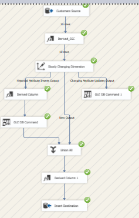
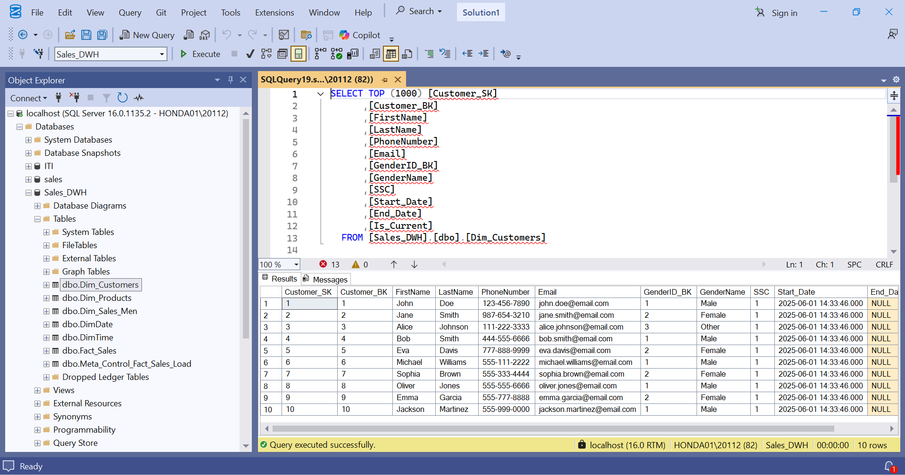
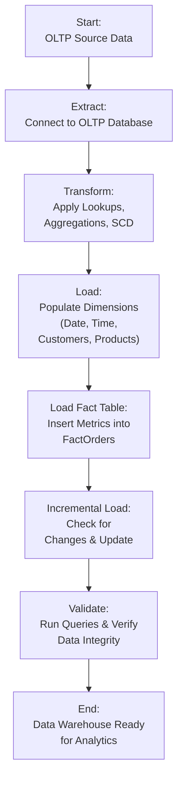

# 🚀 Sales Data Warehouse Design & ETL Pipeline – SSIS Project  

---

## 🌟 **Project Overview**  

**🚀 Sales ETL Mastery with SSIS 🚀**  
*🔥 Transform OLTP chaos into a powerful star schema data warehouse – Efficient, incremental, and historically accurate!*  

This project was developed as a **Data Engineering Lab (May 2025)**, focusing on building a star schema data warehouse from an OLTP sales system. Using SSIS, I created ETL pipelines for extracting, transforming, and loading data, implementing incremental loads, slowly changing dimensions (SCD), and custom Date/Time dimensions for robust analytics.

---

## 📈 **Key Features** 💡  

### 🎯 Star Schema Design
- Designed fact tables with key metrics (e.g., sales amounts, quantities) and dimension tables (e.g., DimCustomers, DimProducts, DimDate, DimTime)  
- Ensured historical accuracy with Slowly Changing Dimensions (SCD Type 2)  

### 🔌 ETL Pipelines with SSIS
- Configured data sources (OLTP database) and destinations (DWH)  
- Implemented incremental loads to optimize performance and reduce data processing time  
- Handled data transformations, lookups, and error handling in SSIS packages  

### 🌡️ Dimension Creation
- Generated Date dimension (e.g., fiscal years, holidays) and Time dimension for granular analysis  
- SQL scripts for creating and populating dimensions and facts  

### ⚡ Performance & Reliability
- Tested with real OLTP data for seamless integration  
- Screenshots of successful SSIS executions and data flows  

---

## 📷 **Visual Results Sample**  

### SSIS Customer Dimension Data Flow
  
*SSIS data flow task for customer dimension extraction and transformation.*

### SQL Server Customer Dimension Verification
  
*Verified customer dimension table in SQL Server Management Studio.*

### SSIS Sales Fact Data Flow

*SSIS data flow task for sales fact table loading.*

---

## 🚀 **Technical Highlights**  

### ⚡ Robust ETL Architecture
- SSIS packages (.dtsx) for modular data pipelines  
- SQL scripts for schema creation and data population  

### 🛡️ Data Integrity & Optimization
- Incremental loading to handle large datasets efficiently  
- SCD implementation for tracking changes over time  
- Error handling and logging in SSIS  

### 🌍 Tools & Compatibility
- Built with **Visual Studio** and **SQL Server Integration Services (SSIS)**  
- Compatible with SQL Server databases  
- Includes project files (.sln, .dtproj, .dtsx) and SQL scripts for easy reproduction  

---

## 🎨 **Workflow Diagram**

## 🌐 Project Structure & Usage

sales.bak: The OLTP database
Screenshots of SSIS executions are included for verification.

Lab6 Folder: Contains SQL scripts and SSIS project:

1.0 CreateDimDate.sql: Creates and populates Date dimension.
2 CreateDimTime.sql: Creates Time dimension.
CreateDimensionsAndFacts.sql: Sets up other dimensions and fact tables.
sales_etl subfolder:

DimCustomers.ETL.dtsx: Package for customer dimension.
DimProducts.ETL.dtsx: Package for product dimension.
DimSalesMen.ETL.dtsx: Package for salesmen dimension.
FactOrders.ETL.dtsx: Fact table loading package.
Sales_ETL.dtproj: SSIS project file.
Sales_ETL.sln: Visual Studio solution.
params: Configuration files.
connmgr: Connection manager files.

To run:

1. Open Lab6/sales_etl/Sales_ETL.sln in Visual Studio.
2. Configure connection managers (e.g., OLTP source, DWH destination).
3. Execute packages for ETL process.
4. Run SQL scripts in SQL Server Management Studio to create schema.

## 💡 Future Enhancements

Integrate Azure Data Factory for cloud-based ETL scaling
Add machine learning for predictive sales analytics
Implement real-time streaming with Kafka or Event Hubs

